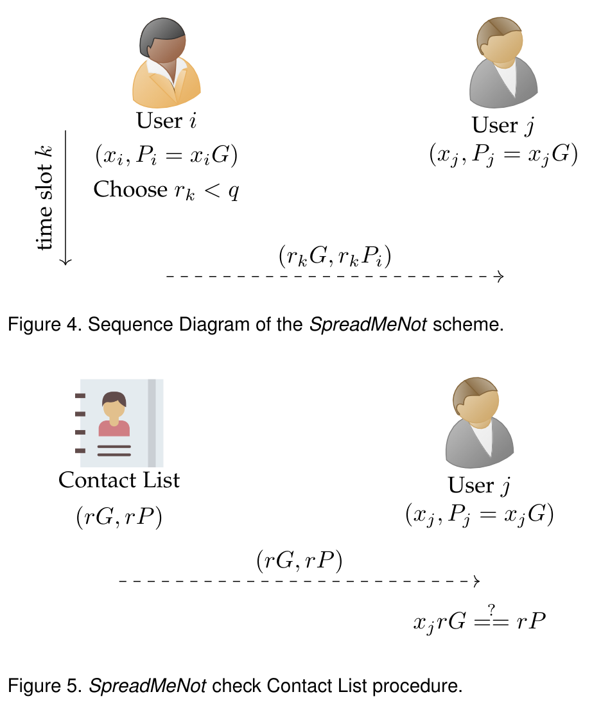
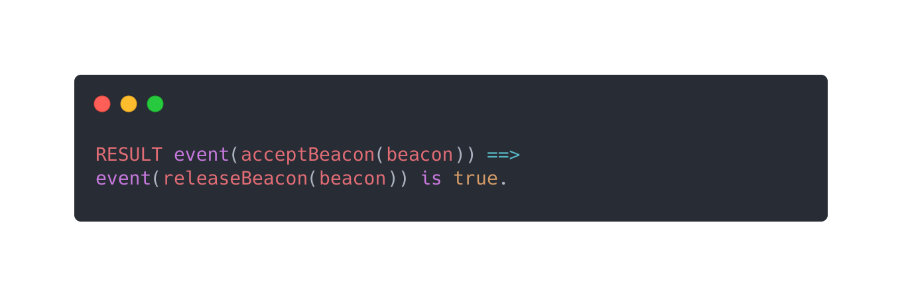

# SpreadMeNot: A Provably Secure and Privacy-Preserving Contact Tracing Protocol
A novel contact tracing protocol that can defend against most passive and active attacks, thus providing strong (provable) security and privacy guarantees that are necessary for such a sensitive application.


<p align="center">
  
</p>

The details will be provided in the paper.


## Formal verification with ProVerif
The security properties of `SpreadMeNot` have been verified formally and experimentally by using the open-source tool <a href="https://prosecco.gforge.inria.fr/personal/bblanche/proverif/">ProVerif 2.02pl1</a>, demonstrating enhanced security protection with respect to state-of-the-art approaches.

In order to test the security properties, download the file <a href="spreadmenot.pv">spreadmenot.pv</a> and run: `./proverif spreadmenot.pv | grep "RESULT"`.

<p align="center">
  
</p>

## Contributing
Contributions are what make the open source community such an amazing place to be learn, inspire, and create. Any contributions you make are greatly appreciated.

## Developers
- Pietro Tedeschi         (<ptedeschi@hbku.edu.qa>)<br />
- Spiridon Bakiras        (<sbakiras@hbku.edu.qa>)<br />
- Roberto Di Pietro       (<rdipietro@hbku.edu.qa>)<br />
Division of Information and Computing Technology (ICT), College of Science and Engineering (CSE)<br />Hamad Bin Khalifa University (HBKU), Doha, Qatar<br />

## License
```SpreadMeNot``` is released under the GNU General Public License v3.0 <a href="LICENSE">license</a>.
